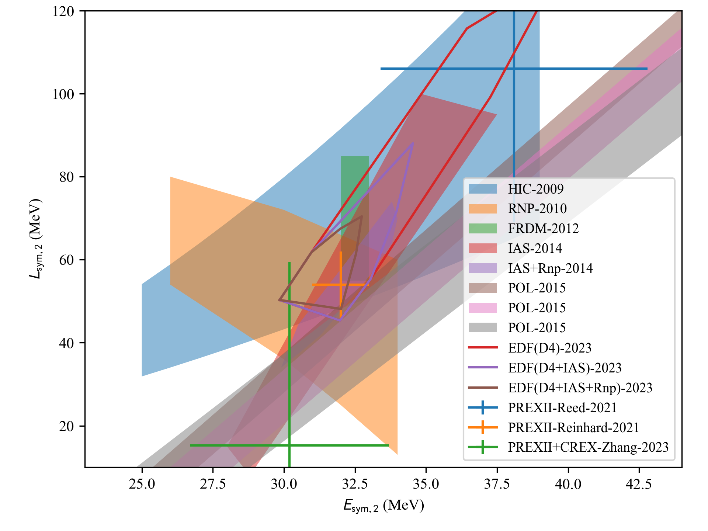
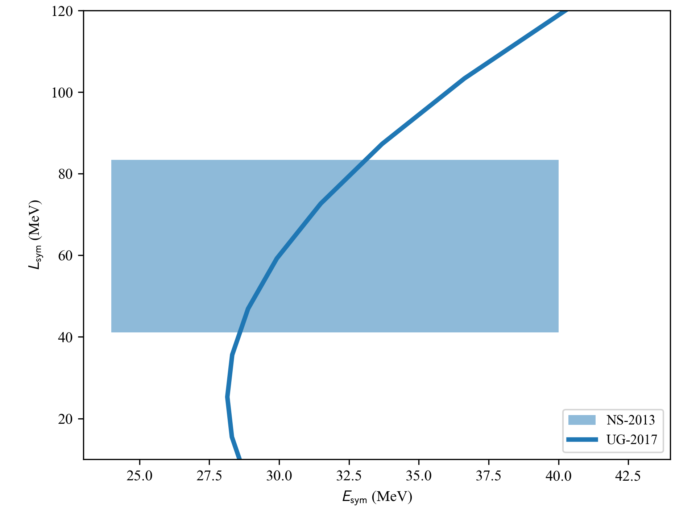

===================
corr.setupEsymLsym
===================

.. currentmodule:: nucleardatapy.corr.setupesymlsym

.. Don't include inherited members to keep the doc short
.. automodule:: nucleardatapy.corr.setup_EsymLsym
	:members:

Here are a set of figures which are produced with the Python sample: /nucleardatapy_sample/corr_setupEsymLsym_plot.py

	This figure shows the Esym,2 versus Lsym,2 correlation for the different constraints available in the nucleardatapy toolkit.

	This figure shows the Esym versus Lsym correlation for the different constraints available in the nucleardatapy toolkit.
