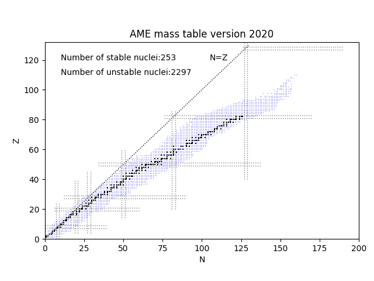

===========
SetupMasses
===========

.. currentmodule:: nucleardatapy.setupmasses

.. Don't include inherited members to keep the doc short
.. automodule:: nucleardatapy.setup_masses
	:members:

Here are a set of figures which are produced with the Python sample: /sample/nucleardatapy_plots/plot_setupMasses.py

	This figure shows the nuclear chart based on AME 2020 table.
