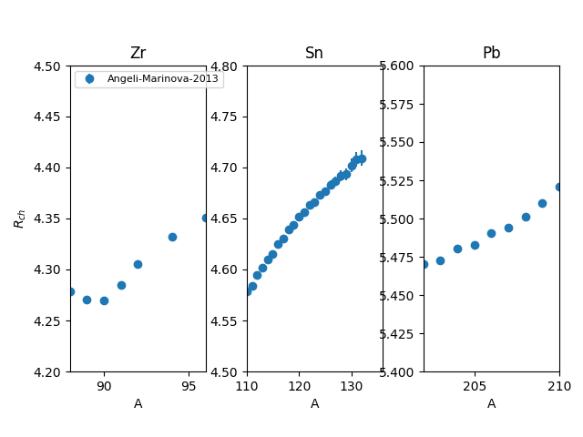

==========
SetupRadCh
==========

.. currentmodule:: nucleardatapy.setupradch

.. Don't include inherited members to keep the doc short
.. automodule:: nucleardatapy.setup_rad_ch
	:members:

	Charge radii for Zn, Sn, and Pb isotopes and for the models available in the nuda toolkit.
