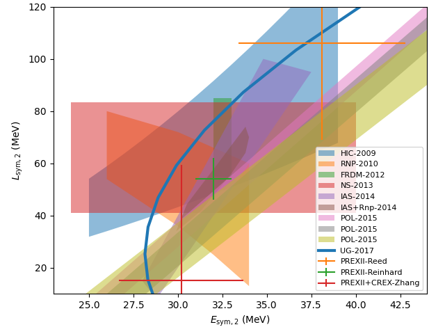

================
SetupCorEsymLsym
================

.. currentmodule:: nucleardatapy.setupcoresymlsym

.. Don't include inherited members to keep the doc short
.. automodule:: nucleardatapy.setup_CorEsymLsym
	:members:

Here are a set of figures which are produced with the Python sample: /sample/nucleardatapy_plots/plot_setupCorEsymLsym.py

	This figure shows the Esym,2 versus Lsym,2 correlation for the different constraints availble in the nucleardatapy toolkit.
