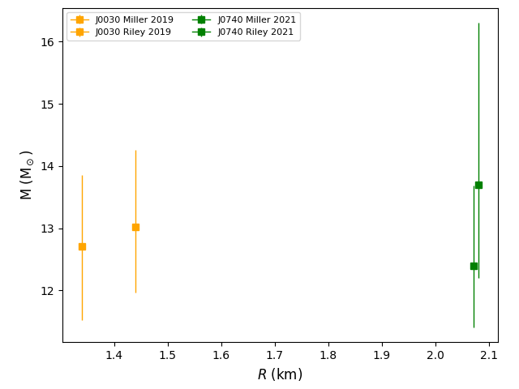

================
SetupAstroMR
================

.. currentmodule:: nucleardatapy.setupastromr

.. Don't include inherited members to keep the doc short
.. automodule:: nucleardatapy.setup_astro_mr
	:members:

Here is a figure which is produced with the Python sample: /sample/nucleardatapy_plots/plot_setupAstroMR.py

	The masses and radii measured by NICER. The different colors correspond to the different sources.

