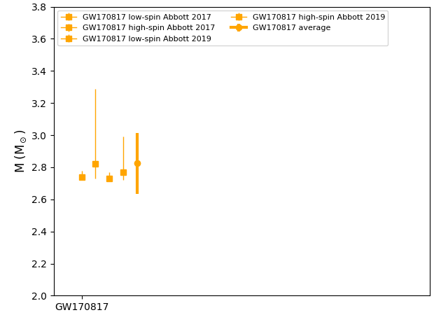

==============
SetupAstroMtot
==============

.. currentmodule:: nucleardatapy.setupastromtot

.. Don't include inherited members to keep the doc short
.. automodule:: nucleardatapy.setup_astro_mtot
	:members:

Here is a figure which is produced with the Python sample: /sample/nucleardatapy_plots/plot_setupAstroMtot.py

	The total mass measured fo binary neutron star mergers. The different colors correspond to the different sources.

