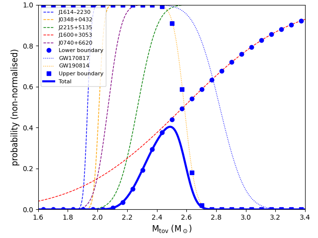

==============
SetupAstroMtov
==============

.. currentmodule:: nucleardatapy.setupastromtov

.. Don't include inherited members to keep the doc short
.. automodule:: nucleardatapy.setup_astro_mtov
	:members:

Here is a figure which is produced with the Python sample: /sample/nucleardatapy_plots/plot_setupAstroMtov.py

	The probability distribution function for the TOV mass constructed from radio and gravitational-wave observations.
	The different colors correspond to the different sources.

