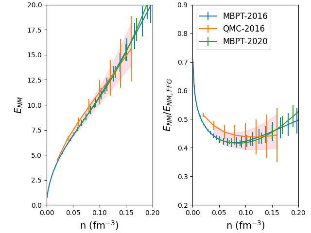
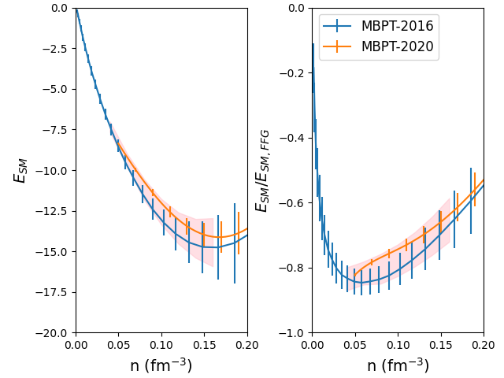
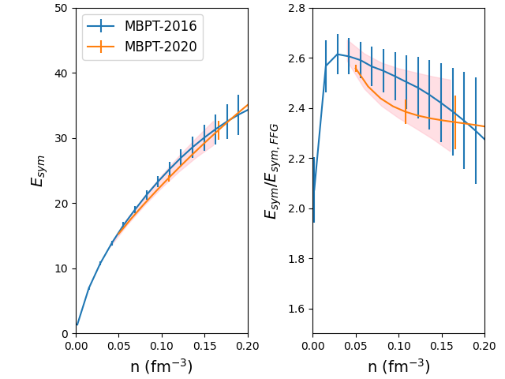

====================
SetupEOSMicroBand
====================

.. currentmodule:: nucleardatapy.setupeosmicroband

.. Don't include inherited members to keep the doc short
.. automodule:: nucleardatapy.setup_eos_micro_band
	:members:

	Uncertainty band in NM obtained from the analysis of different predictions: MBPT-2016, QMC-2016 and MBPT-2020.

	Uncertainty band in SM obtained from the analysis of different predictions: MBPT-2016 and MBPT-2020.

	Uncertainty band for the symmetry energy obtained from the analysis of different predictions: MBPT-2016 and MBPT-2020.
