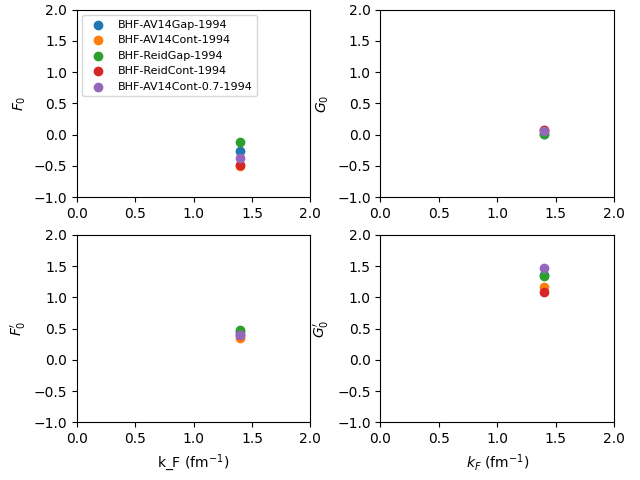
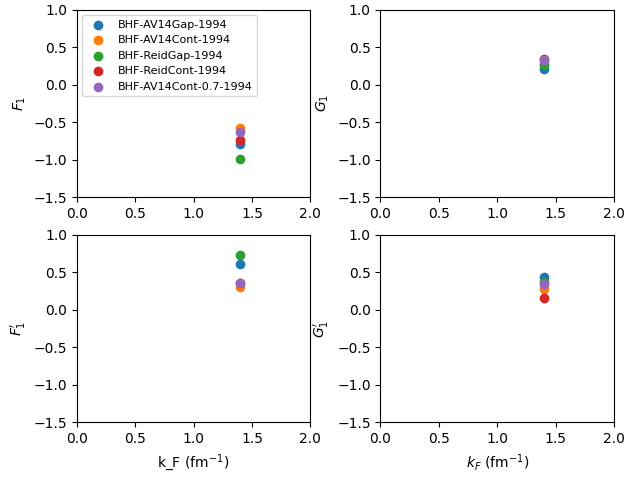

===============
SetupEOSMicroLP
===============

.. currentmodule:: nucleardatapy.setupeosmicrolp

.. Don't include inherited members to keep the doc short
.. automodule:: nucleardatapy.setup_eos_micro_lp
	:members:

Here are a set of figures which are produced with the Python sample: /sample/nucleardatapy_plots/plot_setupeosmicroLP.py

	This figure shows the L=0 Landau parameters in SM for different NN interactions obtained
	from BHF calculations.

	This figure shows the L=1 Landau parameters in SM for different NN interactions obtained
	from BHF calculations.
