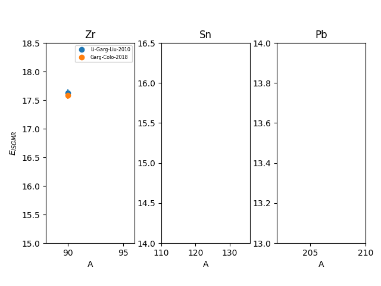

================
SetupNucISGMRExp
================

.. currentmodule:: nucleardatapy.setupNucISGMRExp

.. Don't include inherited members to keep the doc short
.. automodule:: nucleardatapy.setup_nuc_isgmr_exp
	:members:

	Experimental ISGMR energies available in the nucleardatapy toolkit.